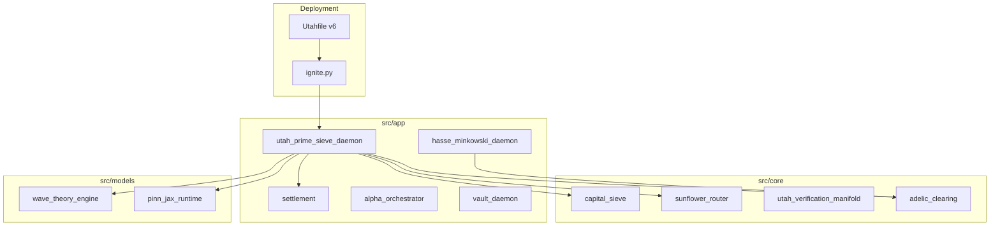

# Architecture Overview

**Repository:** [github.com/utahisnotastate/utahfinancelibrary](https://github.com/utahisnotastate/utahfinancelibrary)  
**Version:** 6.Omnibus_Adelic

## System diagram

## Module responsibilities

| Layer | Module | Output |
|-------|--------|--------|
| FinOps audit | `AutonomousAuditor` | `AllocationIntent` list |
| Routing | `UtahTransfiniteSieve` | Disjoint capital petals |
| Settlement | `AutonomousSettlementEngine` | `SettlementInstruction` list |
| Adelic | `AdelicClearinghouseEngine` | Zero-collateral atomic ledger swap |
| Alpha | `OrthogonalWaveStatePredictor` | Wave-state predictions (JAX) |
| Risk | `AlphaOrchestrator` | Guarded execution queue |
| Custody | `SovereignVault` | Threshold-signed intents |
| Validation | `InvarianceValidationLattice` | Omnibus audit booleans |

## Data flow (demo pipeline)

1. Positions ingested → drag audit → migration intents  
2. Liquidity nodes → sunflower petals → netting summaries  
3. Yield harvest → tithe / humanitarian / reinvest splits  
4. Adelic trade → local-global verify → atomic settlement hash  
5. Optional PINN train/predict on synthetic features  

## Extension points

- Replace demo vaults with live PB/custody feeds  
- Persist `settlement_hash` to append-only storage  
- Wire `SovereignVault` to HSM/TSS providers  
- Deploy via [utahcontainerengine](https://github.com/utahisnotastate) when available  

See [docs/README.md](docs/README.md) for role-specific guides.
