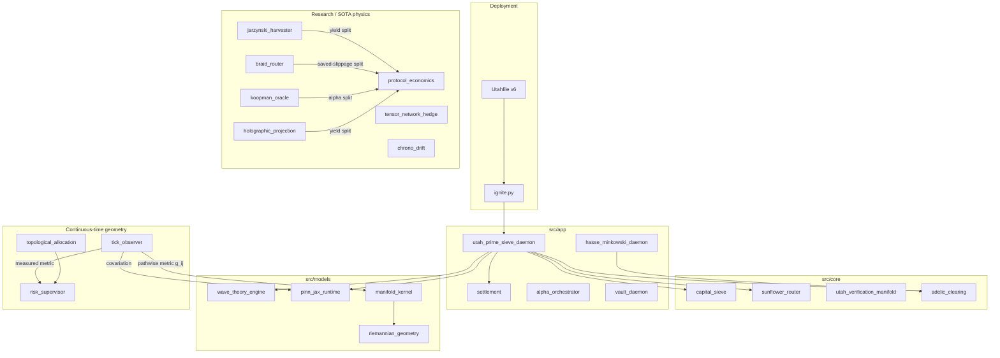

# Architecture Overview

**Repository:** [github.com/utahisnotastate/utahfinancelibrary](https://github.com/utahisnotastate/utahfinancelibrary)  
**Version:** 6.Omnibus_Adelic

## System diagram

## Module responsibilities

| Layer | Module | Output |
|-------|--------|--------|
| FinOps audit | `AutonomousAuditor` | `AllocationIntent` list |
| Routing | `UtahTransfiniteSieve` | Disjoint capital petals |
| Settlement | `AutonomousSettlementEngine` | `SettlementInstruction` list |
| Adelic | `AdelicClearinghouseEngine` | Zero-collateral atomic ledger swap |
| Alpha | `OrthogonalWaveStatePredictor` | Wave-state predictions (JAX) |
| Risk | `AlphaOrchestrator` | Guarded execution queue |
| Custody | `SovereignVault` | Threshold-signed intents |
| Validation | `InvarianceValidationLattice` | Omnibus audit booleans |
| Pathwise metric | `QuadraticCovariationObserver` | Measured metric tensor `g_ij(t)` from ticks |
| Geometric denoising | `compute_ricci_flow_covariance` | Exact-autodiff Ricci-flow covariance |
| Exact curvature | `riemannian_geometry` | Christoffel / Riemann / Ricci via `jax.jacfwd` |
| Topological allocation | `optimize_topological_risk_parity` | Persistent-homology risk parity |
| Spectral risk wall | `feynman_kac_drawdown_bound` | Laplace-Beltrami drawdown supremum |
| Microstructure feature | `holographic_order_book_pressure` | AdS/CFT-style bounded LOB pressure |
| Diversification diagnostic | `von_neumann_portfolio_entropy` | MPS / Von Neumann entropy spectrum |
| Pathwise sensitivities | `malliavin_delta_european_call` | Malliavin/Skorokhod Greeks on complete paths |
| Non-equilibrium estimator | `extract_fluctuation_arbitrage` | Jarzynski ΔF + Crooks irreversibility scale |
| Execution ordering | `optimize_execution_braid` | Min non-commutative impact + Kauffman/Jones invariant |
| Spectral forecasting | `compute_koopman_edmd_prediction` | Koopman/EDMD lifted-space linear forecast |
| Yield accounting | `enforce_universal_tithe` | Transparent 10.0% + 2.3% split of positive yield |

## Continuous-time geometry layer

The v6 geometry stack treats allocation as continuous-time differential geometry
rather than static quadratic programming. It **measures** the market's metric
tensor instead of modelling it:

- `tick_observer.py` — reads the pathwise quadratic covariation
  `g_ij(t) = d/dt ⟨X_i, X_j⟩_t` directly from the tick stream (zero look-back lag),
  with a noise-robust two-scale estimator for raw exchange feeds.
- `manifold_kernel.py` / `riemannian_geometry.py` — exact `jax.jacfwd` Ricci-flow
  covariance denoising; no finite differences.
- `topological_allocation.py` — persistent-homology risk parity and the
  Betti-number divergence crash diagnostic.
- `risk_supervisor.py` — Laplace-Beltrami principal eigenvalue → Feynman-Kac
  drawdown bound, consuming the measured metric.

See [docs/08-continuous-time-allocation.md](docs/08-continuous-time-allocation.md)
and [docs/09_Ricci_Flow_Stabilization.tex](docs/09_Ricci_Flow_Stabilization.tex).

## Research / SOTA physics modules

Beyond the core geometry stack, the library carries a set of research-grade
modules that borrow machinery from mathematical physics. Each is implemented as a
**genuine, tested estimator/diagnostic** with explicit honest-framing notes — none
claims a free lunch, an oracle, or zero-slippage:

- `holographic_projection.py` — AdS/CFT-style hyperbolic weighting of order-book
  depth into a bounded, contemporaneous pressure feature.
- `tensor_network_hedge.py` — Matrix Product State / Von Neumann entanglement
  entropy as a diversification-concentration diagnostic.
- `chrono_drift.py` — Malliavin/Skorokhod calculus for Greeks and risk
  decomposition on **complete** paths (no look-ahead).
- `jarzynski_harvester.py` — Jarzynski equality free-energy estimate and Crooks
  irreversibility (KL-divergence) measurement from order-flow work.
- `braid_router.py` — Temperley-Lieb/Kauffman-bracket invariant of an execution
  braid plus minimisation of non-commutative cross-impact ordering.
- `koopman_oracle.py` — Koopman operator via EDMD: a closed-form linear forecast
  in a lifted observable space (finite-dictionary approximation).

All positive-yield/saving outputs route through the transparent, configurable,
removable `enforce_universal_tithe` accounting helper (10.0% humanitarian + 2.3%
protocol). See LaTeX notes
[11_Jarzynski_Harvesting.tex](docs/11_Jarzynski_Harvesting.tex),
[12_Braid_Execution.tex](docs/12_Braid_Execution.tex),
[13_Koopman_Linearization.tex](docs/13_Koopman_Linearization.tex).

## Data flow (demo pipeline)

1. Positions ingested → drag audit → migration intents  
2. Liquidity nodes → sunflower petals → netting summaries  
3. Yield harvest → tithe / humanitarian / reinvest splits  
4. Adelic trade → local-global verify → atomic settlement hash  
5. Optional PINN train/predict on synthetic features  

## Extension points

- Replace demo vaults with live PB/custody feeds  
- Persist `settlement_hash` to append-only storage  
- Wire `SovereignVault` to HSM/TSS providers  
- Deploy via [utahcontainerengine](https://github.com/utahisnotastate) when available  

See [docs/README.md](docs/README.md) for role-specific guides.
